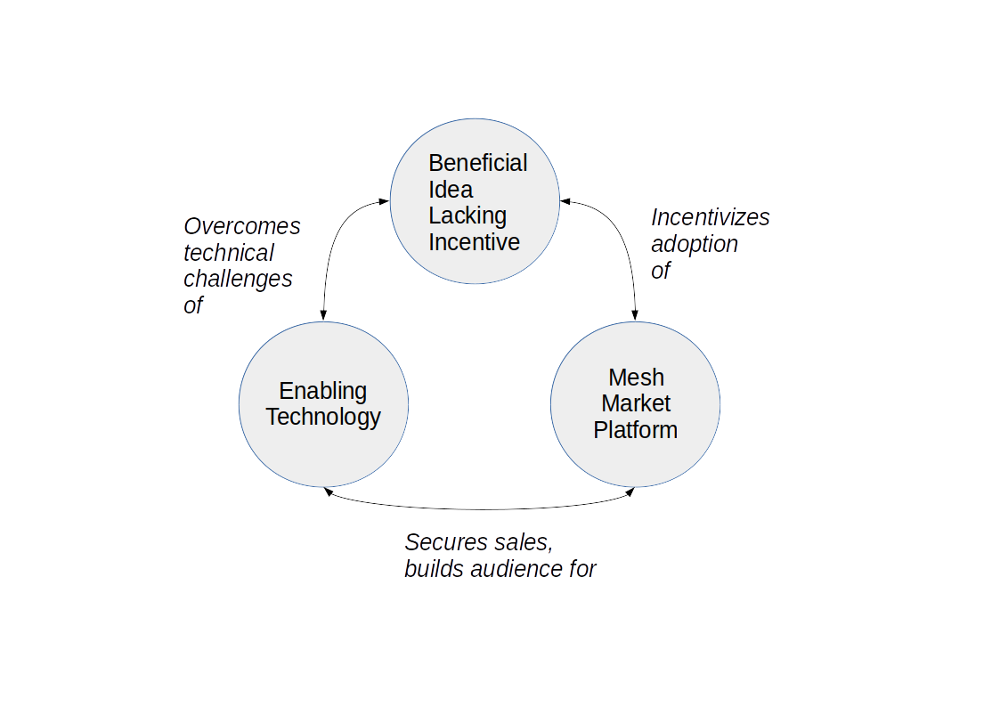
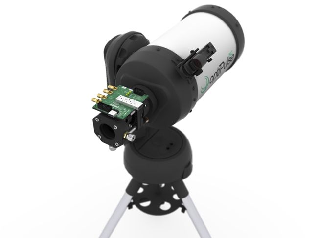
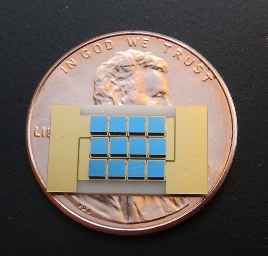
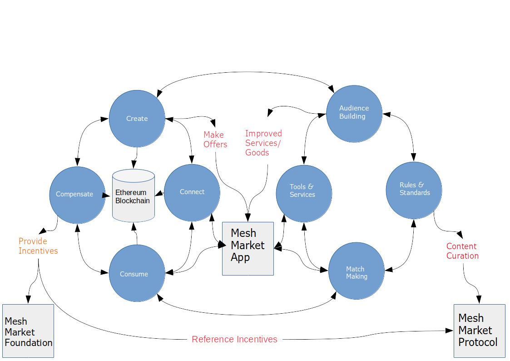
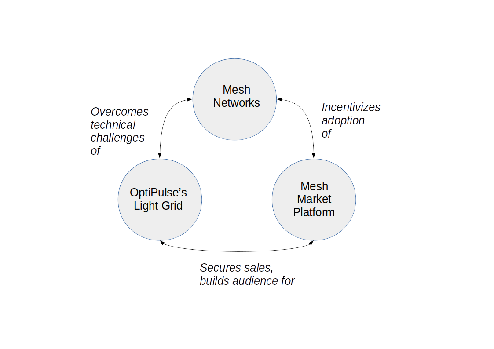

<h2>Table of Contents</h2>

<ul>
<li><a href="#sec-1">1. Introduction</a></li>
<li><a href="#sec-2">2. Background</a>
<ul>
<li><a href="#sec-2-1">2.1. Platform Business</a>
<ul>
<li><a href="#sec-2-1-1">2.1.1. Overview</a></li>
</ul>
</li>
<li><a href="#sec-2-2">2.2. Mesh Networking</a>
<ul>
<li><a href="#sec-2-2-1">2.2.1. Advantages</a></li>
<li><a href="#sec-2-2-2">2.2.2. Disadvantages, Obstacles</a></li>
</ul>
</li>
<li><a href="#sec-2-3">2.3. OptiPulse's Light Grid</a>
<ul>
<li><a href="#sec-2-3-1">2.3.1. Specs</a></li>
</ul>
</li>
<li><a href="#sec-2-4">2.4. Blockchain</a>
<ul>
<li><a href="#sec-2-4-1">2.4.1. Smart Contracts</a></li>
<li><a href="#sec-2-4-2">2.4.2. Ethereum</a></li>
</ul>
</li>
</ul>
</li>
<li><a href="#sec-3">3. The Mesh Market Platform</a>
<ul>
<li>
<ul>
<li><a href="#sec-3-0-1">3.0.1. Case Study: OptiPulse &#x2013; Making Mesh Networks Mass-Market Viable</a></li>
<li><a href="#sec-3-0-2">3.0.2. Building the Platform to End Platforms</a></li>
</ul>
</li>
</ul>
</li>
<li><a href="#sec-4">4. Application</a>
<ul>
<li><a href="#sec-4-1">4.1. Design</a>
<ul>
<li><a href="#sec-4-1-1">4.1.1. Installation</a></li>
<li><a href="#sec-4-1-2">4.1.2. Core Features</a></li>
<li><a href="#sec-4-1-3">4.1.3. GUI</a></li>
<li><a href="#sec-4-1-4">4.1.4. API</a></li>
<li><a href="#sec-4-1-5">4.1.5. Embeddable Widget</a></li>
<li><a href="#sec-4-1-6">4.1.6. Transaction Sequence Diagram</a></li>
<li><a href="#sec-4-1-7">4.1.7. Possible Directions</a></li>
</ul>
</li>
<li><a href="#sec-4-2">4.2. Use Cases</a>
<ul>
<li><a href="#sec-4-2-1">4.2.1. Internet</a></li>
<li><a href="#sec-4-2-2">4.2.2. Energy</a></li>
<li><a href="#sec-4-2-3">4.2.3. Agriculture</a></li>
<li><a href="#sec-4-2-4">4.2.4. Transportation</a></li>
<li><a href="#sec-4-2-5">4.2.5. Real Estate</a></li>
<li><a href="#sec-4-2-6">4.2.6. Small Business/Entrepreneurs</a></li>
<li><a href="#sec-4-2-7">4.2.7. Government</a></li>
<li><a href="#sec-4-2-8">4.2.8. City Planners</a></li>
<li><a href="#sec-4-2-9">4.2.9. Suggest a Use Case!</a></li>
</ul>
</li>
<li><a href="#sec-4-3">4.3. Development TODO's</a>
<ul>
<li><a href="#sec-4-3-1">4.3.1. Whitepaper</a></li>
<li><a href="#sec-4-3-2">4.3.2. App</a></li>
</ul>
</li>
</ul>
</li>
<li><a href="#sec-5">5. The Mesh Market Foundation</a></li>
<li><a href="#sec-6">6. How to Contribute</a></li>
</ul>

    ███╗   ███╗███████╗███████╗██╗  ██╗    ███╗   ███╗ █████╗ ██████╗ ██╗  ██╗███████╗████████╗
    ████╗ ████║██╔════╝██╔════╝██║  ██║    ████╗ ████║██╔══██╗██╔══██╗██║ ██╔╝██╔════╝╚══██╔══╝
    ██╔████╔██║█████╗  ███████╗███████║    ██╔████╔██║███████║██████╔╝█████╔╝ █████╗     ██║
    ██║╚██╔╝██║██╔══╝  ╚════██║██╔══██║    ██║╚██╔╝██║██╔══██║██╔══██╗██╔═██╗ ██╔══╝     ██║
    ██║ ╚═╝ ██║███████╗███████║██║  ██║    ██║ ╚═╝ ██║██║  ██║██║  ██║██║  ██╗███████╗   ██║
    ╚═╝     ╚═╝╚══════╝╚══════╝╚═╝  ╚═╝    ╚═╝     ╚═╝╚═╝  ╚═╝╚═╝  ╚═╝╚═╝  ╚═╝╚══════╝   ╚═╝

A Marketplace for Decentralized Resources on the Blockchain

# Introduction

Mesh Market is a free application aiming to:

-   introduce the benefits of peer-to-peer goods and services to the public at large
-   enable consumers to find friendlier and cheaper local alternatives to centrally-owned, inefficient resources
-   accelerate deployment and improve market viability of beneficial technologies by providing them with a direct-to-consumer platform

Check out the prototype (under construction &#x2013; very early stage, can't handle transactions yet):
<https://optipulse.github.io>

With Mesh Market, you can:
-   get cheaper, better internet service
-   start a do-it-yourself ISP
-   start a profitable energy business from your own home
-   reduce your electricity bills while supporting renewable energy
-   do countless other things we haven't thought of, and some we have (see more use cases, or read on for an overview of how it works)

# Background

The Mesh Market app was originally conceived by developers at OptiPulse who were envisioning a direct-to-consumer platform for getting OptiPulse's internet technology
to the market.  Eventually it was realized that the same infrastructure for doing this could also be used to decentralize resources besides bandwidth, and the Mesh Market Foundation was created to develop the app to its full potential.

## Platform Business

### Overview

A platform business erases the distinction between producers and consumers of goods and services by providing consumers with some form of infrastructure for creating value on their own.  This infrastructure is
often an unassuming means of facilitating customer match-making, such as Uber's mobile app.  Such businesses tend to uncover value already existent, but previously unrecognized - mainly because it resides in the hands of consumers.
Platform business have shown us that this sort of value actually constitutes the lion's share of the market - when it is effectively utilized.
As Tech Crunch put it

    "Uber, the world’s largest taxi company, owns no vehicles. Facebook, the world’s most popular media owner,
     creates no content. Alibaba, the most valuable retailer, has no inventory. And Airbnb, the world’s largest
    accommodation provider, owns no real estate. Something interesting is happening."

As internet access becomes more ubiquitous, this trend will intensify.  But as we've seen lately with Uber and AirBnB's legal battles, this isn't a welcome change for all.
Despite the innocuous tenets of the "sharing economy" with which some platforms hope to be identified, opposition to their practices isn't without merit; if you look under the hood of the biggest platforms, it's business as usual.
The 'Invisible Hand' is just as unlikely to guide a giant platform as it is a giant pipeline to put people over profits.  Examples aren't hard to find in current news headlines; in Britain, regulators are taking issue with
the convenience with which Uber can hire full-time workers without taking on the responsibilities of a full-time employer, like providing health insurance .  Furthermore, contractors have complained about the substantial cut it takes from drivers, typically 20%, which
indeed seems hefty considering the labor involved by the contractors.  As mentioned, platform businesses facing such criticism seek to identify themselves with the bigger picture &#x2013; they are purveyors of this "sharing economy" average-joes are so keen on.
AirBnb, for instance, is promoting a global consumer movementas a shield to their foreseeable legal woes.  But before consumers rise to the defense of the sharing economy à la Uber, might it not be better to ask for a better platform?  If so many people are willing to defend the admittedly imperfect platforms they've come to rely on, why can't some of these people
offer an alternative?  We believe the demand for this platform exists already, though it is yet to be realized.  Mesh Market strives to become this platform.

Mesh Market is like a black-box into which one can put ideas that are good, but challenging to implement, and expect positive developments to come out.

To see how this works, let's start with a good idea..

## Mesh Networking

Before we discuss how Mesh Market makes it so easy to decentralize resources, we need to explain why adopting mesh networks would be a good idea.

According to Wikipedia, "A mesh network is a network topology in which each node relays data for the network. All mesh nodes cooperate in the distribution of data in the network."

In other words, mesh networks get rid of centralized computing resources in favor of distributed networks.

Mesh Market takes this concept to the next level and seeks to decentralize all resources - insofar as that's possible.

The original goal of this app was to develop OptiPulse unique potential for revolutionizing the mesh/ad-hoc networking market with its Light Grid technology.  Bandwidth, via mesh-networking, is the first resource
that Mesh Market aims to decentralize - though by no means the last.While the mesh-networking userbase is presently miniscule compared to that of conventional, centrally serviced connections (usually provided by one of only a few differnet ISP's), meshes offer many advantages
over heterogeneous networks, making them the ideal network topology for future networks needing to prioritize scalability.  There are many articles/papers weighing these advantages, so the discussion here will be brief:

### Advantages

1.  Scalability:

    Adding more devices to the network tends to improve mesh connections, in contrast to star topologies.  More devices connected to a mesh network locally means more possible paths through which internet traffic can be routed.

2.  Robustnesss:

    There is no central point of failure in a mesh network.  Power outages, network attacks, and threats to individual nodes circulate and infect the entire network, as in a star topology.
    Those who were able to get WIFI in the aftermath of Hurricane Sandy know this isn't mere speculation.  <http://techpresident.com/news/23127/red-hook-mesh-network-connects-sandy-survivors-still-without-power>

3.  Democritization:

    Dictators have been known to cut off internet service during popular uprisings (e.g. Arab Spring).  It is virtually impossible to "shut down" a mesh-based internet. Without the imperitave for centrally-connected hubs, disrupting connections becomes very hard to achieve.
    (Sorry Donald Trump).

    That authorities might cut off the internet is significantly less likely in countries without egregious network collusion with government as we
    see in many developing countries.  Such countries may turn out to be some of the best stages on which to demonstrate the power of decentralized markets for effecting positive social change.

    One criticism of the idea that mesh networks could make the internet impervious to control by dictators is that WIFI signals can be traced and individuals can be targeted even
    if the network is a mesh .  This criticism would not apply to a network using OptiPulse's
    technology, since its point-to-point signals are not broadcast and would be very difficult to intercept.

### Disadvantages, Obstacles

There are also several difficulties associated with meshes that shouldn't be overlooked.  Some of these may be mitigated by the design of an app fulfilling many
functions normally assigned to the network administrator, while others may be reducable to inadequacies of present physical layer technologies.

1.  Power Consumption

    From link-labs: "Because each node in a mesh has to act as an endpoint and a router, it has to draw more power to operate. Thus, if you have battery-powered, low-power nodes, a mesh may be difficult to deploy without a lot of network planning."

2.  Latency

3.  Requisite Technical Competence

    Currently, most mesh networking protocols are available solely as command line tools for Unix-like operating systems.  As it stands, this significantly reduces the class of users
    capable of connecting to a mesh network.

4.  Opposition from Established Middlemen

    Analagous to the situation faced by Tesla due to their direct-to-consumer market, those who normally take a large share of the profits by acting as middle-men
    between the consumer and the product/service stand to lose much in a decentralized consumer-to-consumer market.  This means that, just as Tesla sales have been
    blocked in certain states due to the threat it poses to the established car-dealership model,
    a mesh-networking platform with a chance of succeeding may raise the defenses of ISP's. This possibility should be discussed in more detail.  It seems to me that
    the case against a mesh-networks would be much more difficult to make, and legal challenges are unlikely to pose a sustained threat.

## OptiPulse's Light Grid

OptiPulse is a tech startup with a revolutionary internet technology called the Light Grid.  It is a physical-layer technology based on a novel invention in electro-optics, which just so happens to
overcome many of the difficulties associated with mesh networks like power consumption and latency.  Like other elite photonic transmitters, it is capable of 5G bit-rates.  Unlike fiber-optics, however, it is wireless and therefore relatively cheap and easy to deploy.
Mesh Market has secured an early partnership with OptiPulse which will allow the opening of its products for pre-sale to end-consumers and network planners.

OptiPulse's Prototype

### Specs

1.  Bandwidth

    OptiPulse has demonstrated 10Gb/s + bit rates.  This is thousands of time faster than what the FCC allows to be advertised as high-speed internet, or broadband.

2.  Distance

    Early tests and estimates have projected that the Light Grid's transmission range may be over 10 km.

3.  Deployability

    Unlike fiber-optics, there is no digging up of long stretches of earth to connect two end-points.  This is typically the brunt of the cost associate with FO.  As you can imagine,
    this also avoids legal difficulties like zoning laws.

4.  Unlicensed Spectrum

    The Light Grid uses a part of the RF spectrum that isn't licensed.  Not only is signal interference negligible compared to typical broadcast connections like WiFi, but contending with competitors
    over spectrum licensing is also a non-issue.

5.  Ecological Friendliness

    Taking load off the typical spectrum range also has huge benefits to living organisms, which many believe are harmed by the proliferation of microwaves in the atmosphere used for
    communication.

6.  Low Size, Weight

    Did we mention how small the Light Grid is?
    

7.  Low Power-Consumption

8.  Low Cost

    Perhaps most importantly, an infrastructure built on Light Grid technology would be a fraction of the cost of using (comparably fast) fiber.

## Blockchain

Blockchain technology is based on the idea of a distributed ledger.  It is meant to provide trust and security through radical transparency rather than limited access.
Blockchain plays a crucial role in Mesh Market's plan to overcome the inertia keeping local value creation from being released.

### Smart Contracts

The concept of a smart contract was first formulated in the 90's, but required blockchain technology to achieve practical implementability.  Basically a smart contract is
a contract that can execute itself.  This means that terms and conditions are defined programatically, such that a computer can know how they should be interpreted.
Of course, this limits the contents of the contract to what is computationally tractable.  For example, a smart contract may define certain operations being executed when an
account on the blockchain receives a certain amount of funds.

### Ethereum

# The Mesh Market Platform

It may not seem obvious from the simplistic discussion of smart contracts above, but the ability for computers to listen to data and execute transactions on a blockchain enables the implementing of
an innumerable array of business solutions heretofore unworkable or impractical - particularly those based on the idea of turning a traditionally top-down service into a consumer-to-consumer platform.
Decentralized platforms based on blockchain/smart contracts are already being developed across a range of industries (even entire governemnts!), though it is still too early
for average consumers to have noticeably benefited.  The platform business phenomenon and the sharing economy at large, on the other hand, have had a huge impact on what customers expect from the services they use,
and demonstrated the substantial demand for useful peer-to-peer services.

Where does Blockchain fit in?  There is no shortage of good ideas and technologies that would have a positive impact on the world, if they were only adopted.  Inertia prevents change, even when it is necessary (see Tragedy of the Commons).
We've made the case for certain technologies above; others are making it for renewable energy, a service-based economy, reducing meat consumption, a basic income, and so on.  The ultimate goal of Mesh Market is to create a way to incentivize collective behavior that is manifestly beneficial to everyone.  The purpose of the Mesh Market Protocol is to define what this behavior is.  Finally, the Mesh Market Foundation channels funds into
businesses that seek to implement these solutions, and to incentivize businesses (and people) to use the platform.  Mesh Market the DApp should be thought of as one part of this eco-system.

It would be unwise for any business developing in the post-smart contract world to implement an overtly top-down approach to customer relations.  We take very seriously
the idea that whatever can be decentralized will be decentralized as the world awakens to the utility of the Blockchain.  Of course, this includes any aspects of the Mesh Market platform that
are inadvertently top-down or fail to prioritize customers' priorities.  This is why we open the design of the Mesh Market platform to feedback and revision via the Protocol.
The Mesh Market aspires to be the platform to end platforms; to achieve this, there must be built-in mechanisms for self-correction.

### Case Study: OptiPulse &#x2013; Making Mesh Networks Mass-Market Viable

Remember that black-box for good ideas?

Now it should be clear how this platform might actually help good ideas gain momentum.  As we've made the case for above, OptiPulse's Light Grid enabling mesh networks is one potential
application.

The logic works like this:
Since the benefits of mesh networks are not immediately apparent to anyone not versed in computer networking, getting people to switch may prove a difficult task unless some
incentive is provided.

OptiPulse's incredible physical layer technology may be enough to provide this incentive alone, if OptiPulse were to follow a strategy of exclusively promoting its mesh network
capabilities.  However, this would be unecessarily prescriptive and possibly counterproductive; a better way to show users the advantages of mesh networks would be to give them
a reason to try it for themselves so that they'd come to understand the benefits through firsthand experience.

With the amount of excess bandwidth the Light Grid may be giving customers, they may be able to get away with sharing (or selling) what they don't use to those around them.
(It might not occur to someone with a 12 Mb/s connection to try this).  In effect, this would make buyers of OptiPulse's internet service their own mini ISP's,
analagous to operators of once-widespread internet cafes.  With some added income from selling bandwidth, OptiPulse's users may be able to break even or even make a profit while
receiving some of the best internet service on the market.

### Building the Platform to End Platforms

This implies that OptiPulse, as an ISP, might sell internet that comes with a commercial license (or form thereof) to end-users.  While this would give users the ability to resell
service and potentially cut into some of OptiPulse's target market, there would be some overwhelmingly positive side-effects:

-   Each customer ultimately connected through an OptiPulse uplink is one fewer customer of an OptiPulse competitor.
-   It would be hard to overestimate customer satisfaction with such a deal.  This would grow the network of app users possibly exponentially, and if every transaction is charged a certain amount to go into OptiPulse's "tip jar", this could grow astronomically.
-   If OptiPulse wished to prevent any portion of profit whatsoever from being appropriated by end-users, it would be very simple to stipulate in a smart contract that customers can only sell to those out of range of OptiPulse service.  Other schemes have been proposed, such as offering customers the opportunity to become an OptiPulse franchise.

These benefits seem especially appealing considering that Mesh Market can facilitate other types of exchange besides internet service.  Given the rise of companies like
Uber, AirBnB, Craigslist and others &#x2013; the services of each of which Mesh Market can replicate &#x2013; a general strategy of growing a base network of users and promoting new use-cases
could prove very lucrative.

In the language of Mesh Market, offers translate into smart contracts, which in turn serve as licenses that may be offered by companies acting as users of the platform.  The products/services
of these companies are the driving force behind Mesh Market's various use-cases.  The Mesh Market platform gives these companies free reign over their own contracts, so they are free to test the waters
between the platform and pipelines philosophies.  Minimizing the demand Mesh-Market places on users &#x2013; be they large companies or first-time DIY'ers &#x2013; ensures that the platform
remains agnostic towards content and inviting to any type of endeavor.

# Application

## Design

One design decision built into Mesh Market is to treat users, whether they be businesses or end-consumers in the conventional sense, as basically having the same requirements for using the Mesh Market platform.  This creates an amorphous market which, while inscrutable to classical economists, will tend to multiply
choices and improve services, thereby fulfilling the basic functions of healthy economy.  As we've shown above, An ISP may use the Mesh Market platform to sell internet service without restrictions on how it does so, treating customers as (perhaps equally)
non-restricted entitites that may act as "mini ISP's" in their own right.  Therefore, the most effective design is the one most capable of meeting the business requirements of the "producers", while making little or no distinction between them
and consumers.  The core features of the app, described below, are an attempt to create such an environment.

Mesh networks are inherently friendly to businesses embracing the platform model.  With a decentralized and free communications medium, preferable local alternatives to inefficient,
sub-par goods and services can be discovered.  This is how "free markets" are supposed to work; they only free and efficient insofar as information flow is.

Incidentally, this is why there is no paid advertising on the Mesh Market platform.  It is an intentional design decision that the only information users see when looking for offers is
what they decide is relevant to making a good choice.

### Installation

1.  Dependencies:

    -   1. git
    -   2. Metamask (and Chrome browser)
    -   3. CJDNS, for ad-hoc routing
    -   4. Clojure, for interfacing with device OS (using Trickle )
    -   5. the Mesh Market repository&#x2026;

2.  Instructions:

    Now to get Mesh Market:

    -   1. clone the Mesh Market repo:

        git clone https://github.com/optipulse/mesh-market.git

    -   2. connect to CJDNS
    -   3. sign in to your MetaMask wallet
    -   4. run the Mesh Market server

        $ cd mesh-market
        $ mesh-market run

    Mesh Market is now available in your browser at:
    localhost:8545

    To change the port number, \_.

3.  Simplification (for Non-Nerds)

    We know, that's a lot of installation.  Bear with us until we get something simpler working.

    The Mesh Market Foundation plans to sell minimalist computers in the future shipping with Mesh Market pre-installed plus dependencies.  These will be available in packaged bundles for specific use-cases, such as:

    -   solar starter kit
    -   ISP starter kit
    -   aeroponic starter kit

    and more to come.

### Core Features

### GUI

1.  A. Make an Offer

2.  B. Find an Offer

    1.  TODO add find form

3.  C. Wallet

    1.  Create Wallet

        To create a new wallet, you just need to come up with a good password (your private key.)  Be careful!  If you lose/forget this, it can never be retrieved.

    2.  Open Wallet

        In order to add offers to Mesh Market, you will need your address (the public key you were given when you created your wallet) and your password.

4.  D. Protocol: Definining Resource Consumption for the Future

    The Mesh Market protocol provides dynamically updated in-app documentation for:
    -   the features of the app itself
    -   the contents of offers available in the app

    The Mesh Market Foundation will release an initial protocol specification.  Further development of the protocol may be determined democratically by user-submitted
    entries, which is handled in a section of the website separate from the app.

    A protocol entry includes:
    -   a tag
    -   a recommendation
    -   a justification

    The Mesh Market protocol specifies which technologies are conducive to the overall goals of the Mesh Market Foundation.  Businesses (and individuals acting as businesses)
    may apply for grants to help them develop

    Each user-submitted protocol entry undergoes vetting before it is added to the Protocol Object, which is a JSON object referenced for dynamic updating of in-app documentation.
    Vetting is simple: those entries that receive more upvotes than downvotes are added to the Protocol Object.

    1.  protocol entry syntax:

            {"tag1":
              {"upvotes": "",
               "downvotes" : "",
               "recommendation": "",
               "justification": "",
               "children": ["childTag1", "childTag2", ...]
              },
              "tag2":
              {...}
            }

    2.  a sample protocol entry:

            {"wireless":
              {"upvotes": 15,
               "downvotes": 5,
               "recommendation": "optical",
               "justification" : "more bandwidth, less RF pollution",
               "children": ["optical", "WIFI", "WiGig", ...]
              }
            }

5.  E. Results

    1.  TODO add results section

6.  F. Map

### API

### Embeddable Widget

### Transaction Sequence Diagram

-   1) Make Offer

Before users have the ability to find internet service near them, other users need to be able to advertise that they have available connections. The interaction shown in the above diagram revolves around these two core functions; methods peripheral to these are meant to provide a system of trust to ensure that all parties are satisfied with the transaction.

Making an offer is as simple as filling out a form, which may look something like this:

The submitted data is then made public on the blockchain. Unlike conventional apps, a decentralized app (DApp) does not require a “back-end” that can be pinned geographically to one server or another. Instead, all relevant data is saved to the blockchain and bound to public keys. These keys may represent a simple account balance, as in the case of Bitcoin, or a complete smart contract. Data can include important details about offers like names, descriptions, time-restrictions, etc.

-   2) Find Offer

This step involves another class of user, the offer taker, submitting a form to query data on the blockchain. This is somewhat tricky compared to fetching data from a server where one knows which tables to read data from. Data stored in the Ethereum blockchain is included in a smart contract, which is invoked using a public key. But how can a user find a suitable offer among the multitude of contracts living on the blockchain? Obviously it won’t work to query each available offer for satisfactory properties like bandwidth, price, etc – this would be very inefficient, because many of these might be in different cities or countries. The best solution may be to create a smart contract bound to a geographical area that will limit queries to only local options, or options within a certain range defined by the user.

This introduces some complications. Blockchain data is immutable, but offers available to users will be constantly changing. The most clever way around this is to have the smart contract bound to a geographical area simply point to the latest version of the area’s blockchain, so that queries will be made on up-to-date data. This creates the illusion that the data users are querying is dynamic, though it is actually immutable.

The latest version of Ethereum has native support for this capability. Here’s an example smart contract meant to relay queries to another that is updateable (borrowed from a Stackoverflow answer :

    contract Relay {
        address public currentVersion;
        address public owner;

        function Relay(address initAddr){
            currentVersion = initAddr;
            owner = msg.sender;
        }

        function update(address newAddress){
            if(msg.sender != owner) throw;
            currentVersion = newAddress;
        }

        function(){
            if(!currentVersion.delegatecall(msg.data)) throw;
        }

-   3) Show Results

Displaying the results to the user is completely straightforward; data retrieved from the blockchain can subsequently be passed to the front-end and may be represented on a map and/or table that the user can interact with.

-   4) Take Offer

The most important way a user can interact with the offers they find is to take (accept) one of them. This involves transfering funds to the smart contract the offer represents, which then tells the offer maker’s device to proceed with releasing the consideration.

-   5) Trigger Consideration

With this step, the blockchain informs the offer maker’s device that the offer has been accepted and it should now fulfill its part of the contract.

-   6) Trigger Side Effects

Now that the maker’s device has received the go-ahead to give consideration, computation may be performed to decide how to go about doing this. This could hypothetically be as simple as converting one currency into another, or may be an involved shell script for allocating bandwidth based on the requirements of the contract.

-   7) Send Resources

Once the requisite computation has been performed to send a resource, it may be sent. This is the only step taking place on the physical layer – be it a laser sending messages or a solar panel plus cabel sending power.

-   8) Send Confirmation

The offer taker’s device is then triggered to inform the blockchain that consideration was met, and that funds should be released.

-   9) Transfer Funds

Finally, the funds being held by the contract starting at step 4 are released, and the transaction is complete.

### Possible Directions

1.  Transactions

    1.  Meshmarks: A Credit System for Enabling Seemless Interaction with the Blockchain

        Offers on the Mesh Market can be paid for in currencies of the offer maker's choosing, as well as in the Mesh Market's own virtual currency, Meshmarks.

        Meshmarks enables easy conversion between payment methods.  Users can load credit to their account using PayPal, credit, debit, or a crypto-currency of their choice.

        Users are not required to buy Meshmarks to make transactions with one-another, but it does help users using unequal payment methods (e.g. Bitcoin and PayPal) reach one-another.

    2.  A Possible Cryptocurrency (MMR)

        One possibility that should be discussed is the minting of a new crypto-currency to serve as store credit.  As such, it would be bound to the growth of decentralized resources.

## Use Cases

These use cases will be made into tutorials in the future.

### Internet

1.  Start a DIY ISP .

    -   Difficulty: Medium
    -   Investment:
    -   Profit:

2.  Get Cheaper, Better Internet Service.

    -   Difficulty: Easy
    -   Investment: Low
    -   Profit: N/A

### Energy

1.  Make a Profit on Solar

    -   Difficulty: Medium/Hard
    -   Investment: High
    -   Profit: High

2.  Lower Your Electricity Bills

### Agriculture

1.  Start an Urban Homestead for Profit and Pleasure

    -   Difficulty: Hard
    -   Investment: High
    -   Profit: Medium

2.  Buy Organic Produce Without Paying out the Wazoo

    -   Difficulty: Easy
    -   Investment: Low
    -   Profit: N/A

### Transportation

1.  Make a Living Wage Driving

    -   Difficulty: Medium
    -   Investment: Medium/Low (provided you own a car)
    -   Profit: Medium

2.  Get Your Next Meal Delivered

    -   Difficulty: Easy
    -   Investment: Low
    -   Profit: N/A

### Real Estate

1.  Lease a Spare Room in Your House

    -   Difficulty: Medium
    -   Investment: Low/Medium
    -   Profit: Medium

### Small Business/Entrepreneurs

1.  Add Your Business to the Mesh Market and Reach New Audiences

    -   Difficulty: Easy
    -   Investment: N/A
    -   Profit: Low/Medium/High

2.  Open Your Product for Pre-Sale and Sponsor Your Business Development

### Government

1.  Roll Out Basic Income and Boost Your Economy

2.  Help Citizens Get Insured

### City Planners

### Suggest a Use Case!

Did we miss something?  Submit a pull request!

## Development TODO's

### Whitepaper

1.  TODO add banner w/ logo showing community using decentralized resources

2.  TODO export to HTML

3.  TODO write pre-sale use case

4.  TODO write transportation use cases

5.  TODO write real estate use cases

### App

1.  TODO Base-Site

    1.  TODO create base site

2.  TODO Make Offer

    1.  DONE add units

    2.  DONE autocomplete tags w/ magic suggest

    3.  TODO autocomplete tags w/ vue component

    4.  TODO add currency conversions with vue component

    5.  TODO add countupJS component for currency conversion

    6.  TODO calculate distance for locations

    7.  TODO add countupJS component for distance calculation

    8.  TODO display date interval in offer preview

    9.  TODO on enter go to next

    10. TODO add focus to input

    11. TODO display "next" if input entered, skip if none

    12. TODO add multiple locations with component

    13. TODO convert offer-preview to view component

3.  TODO Protocol

    1.  TODO add protocol section to base site

    2.  TODO create protocol form

    3.  TODO add transition effects to .pro elements

    4.  TODO update protocol object with wallet tags

4.  TODO Wallet

    1.  TODO add address, password to offer model

    2.  TODO

5.  TODO Find Offer

6.  TODO Results

    1.  TODO

7.  TODO Map

    1.  TODO remove zoom

    2.  TODO remove mouse interactivity

# The Mesh Market Foundation

# How to Contribute

1.  Submit on GitHub

    If you have a good idea and you're up to working it out on your own, feel free to submit a pull request.  This isn't limited to code!  Designers, artists, writers, philosophers, - all are encouraged to contribute.

2.  Work with Us

    Or, if you're looking for a more stable position, we're looking for:
    -   Ethereum developers
    -   BitCoin developers
    -   mesh networking experts
    -   sysadmin, Linux experts
    -   web security, cryptography experts
    -   C, Clojure, ClojureScript programmers
    -   mobile app developers (especially w/ Android, FB, iOS experience)
    -   UX experts
    -   DevOps engineers
    -   legal engineers
    -   systems engineers

    Interested?  Don't hesitate to get in touch (please include summary of relevant experience and work samples):
    djoseph@optipulse.com

3.  Donate

    David is a full-stack web developer with extensive experience in building apps for getting cutting-edge technologies into the marketplaces.  He is the lead architect of the Light Grid's application to mesh networks, and is working on solutions for connecting customers through P2P technologies to build robust and scalable networks.

<h2 class="footnotes">Footnotes: </h2>

<a id="fn.1" name="fn.1" class="footnum" href="#fnr.1">1</a> 
<https://techcrunch.com/2015/03/03/in-the-age-of-disintermediation-the-battle-is-all-for-the-customer-interface/>

<a id="fn.2" name="fn.2" class="footnum" href="#fnr.2">2</a> 
<https://www.theguardian.com/technology/2016/jul/19/uber-drivers-court-tribunal-self-employed-uk-employment-law>

<a id="fn.3" name="fn.3" class="footnum" href="#fnr.3">3</a> 
<https://www.theguardian.com/technology/2016/oct/29/airbnb-backlash-customers-fight-back-london>

<a id="fn.4" name="fn.4" class="footnum" href="#fnr.4">4</a> 
<http://europe.newsweek.com/dictator-proofing-internet-68705?rm=eu>

<a id="fn.5" name="fn.5" class="footnum" href="#fnr.5">5</a> 
<https://www.schneier.com/blog/archives/2012/12/dictators_shutt.html#c1034991>

<a id="fn.6" name="fn.6" class="footnum" href="#fnr.6">6</a> 
<https://electrek.co/2016/05/01/tesla-gm-direct-sales-connecticut/>

<a id="fn.7" name="fn.7" class="footnum" href="#fnr.7">7</a> 
<https://github.com/mariusae/trickle> or similar command line tools

<a id="fn.8" name="fn.8" class="footnum" href="#fnr.8">8</a> 
<http://ethereum.stackexchange.com/questions/2404/upgradeable-contracts>

