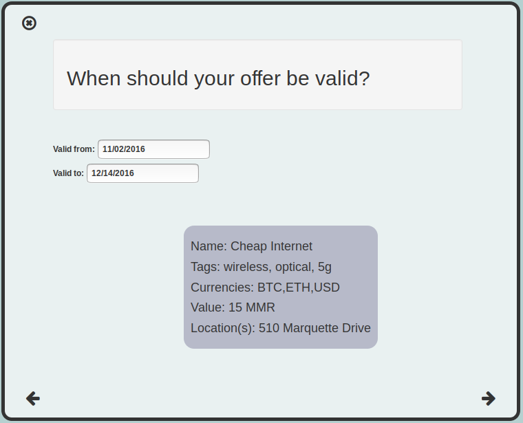

<h2>Table of Contents</h2>

<ul>
<li><a href="#sec-1">1. Introduction</a></li>
<li><a href="#sec-2">2. Background</a>
<ul>
<li><a href="#sec-2-1">2.1. Platform Business</a></li>
<li><a href="#sec-2-2">2.2. Mesh Networking</a>
<ul>
<li><a href="#sec-2-2-1">2.2.1. Advantages of Mesh Networks</a></li>
<li><a href="#sec-2-2-2">2.2.2. Disadvantages, Obstacles</a></li>
</ul>
</li>
<li><a href="#sec-2-3">2.3. Blockchain</a>
<ul>
<li><a href="#sec-2-3-1">2.3.1. Smart Contracts</a></li>
<li><a href="#sec-2-3-2">2.3.2. Incentivizing Behavior</a></li>
<li><a href="#sec-2-3-3">2.3.3. Making Mesh Networks Mass-Market Viable</a></li>
<li><a href="#sec-2-3-4">2.3.4. Undercutting the Competition</a></li>
</ul>
</li>
</ul>
</li>
<li><a href="#sec-3">3. Application</a>
<ul>
<li><a href="#sec-3-1">3.1. Design</a>
<ul>
<li><a href="#sec-3-1-1">3.1.1. Installation</a></li>
<li><a href="#sec-3-1-2">3.1.2. Assumptions</a></li>
<li><a href="#sec-3-1-3">3.1.3. Core Features</a></li>
<li><a href="#sec-3-1-4">3.1.4. Basic: GUI</a></li>
<li><a href="#sec-3-1-5">3.1.5. Advanced: API</a></li>
<li><a href="#sec-3-1-6">3.1.6. Advanced: Embeddable Widget</a></li>
<li><a href="#sec-3-1-7">3.1.7. Possible Directions</a></li>
</ul>
</li>
<li><a href="#sec-3-2">3.2. Use Cases</a>
<ul>
<li><a href="#sec-3-2-1">3.2.1. Internet Service</a></li>
<li><a href="#sec-3-2-2">3.2.2. Energy</a></li>
<li><a href="#sec-3-2-3">3.2.3. Agriculture</a></li>
<li><a href="#sec-3-2-4">3.2.4. Transportation</a></li>
<li><a href="#sec-3-2-5">3.2.5. Real Estate</a></li>
<li><a href="#sec-3-2-6">3.2.6. Small Business/Entrepreneurs</a></li>
<li><a href="#sec-3-2-7">3.2.7. City Planners</a></li>
<li><a href="#sec-3-2-8">3.2.8. Suggest Another Use Case!</a></li>
</ul>
</li>
<li><a href="#sec-3-3">3.3. Development Timeline</a></li>
</ul>
</li>
<li><a href="#sec-4">4. The Mesh Market Foundation</a>
<ul>
<li><a href="#sec-4-1">4.1. Business Model Canvas</a></li>
<li><a href="#sec-4-2">4.2. How to Contribute</a>
<ul>
<li><a href="#sec-4-2-1">4.2.1. Submit Code</a></li>
<li><a href="#sec-4-2-2">4.2.2. Work with Us</a></li>
<li><a href="#sec-4-2-3">4.2.3. Donate</a></li>
</ul>
</li>
</ul>
</li>
</ul>

Mesh Market: A Web 3.0 Platform for Decentralizing Resources

With Mesh Market, you can:
-   get cheaper, better internet service
-   start a do-it-yourself ISP
-   start a profitable energy business from your own home
-   reduce your electricity bills while supporting renewable energy
-   do countless other things we haven't thought of, and some we have (check out more use cases)

# Introduction

This whitepaper outlines the ongoing design and development of Mesh Market.

Mesh Market is a free application that aims to:

-   introduce the benefit of peer-to-peer goods and services to the public at large - starting with internet service.
-   enable consumers to find friendlier and cheaper local alternatives to centrally-owned, inefficient resources
-   provide an infrastructure that knits together communities in order to make the above possible.
-   accelerate deployment of OptiPulse's Light Grid internet technology by opening a direct-to-consumer market.

Most aspects of this idea haven't achieved finality, though the above seems to be a good starting point.  Open discussion between experts across various fields will be needed to
design and build this app as well as form a business that can support it.

Check out the prototype (under construction):
<https://optipulse.github.io>

Needless to say, this is only for the sake of illustration and only represents an early stage of the front-end.  It isn't able to handle transactions yet.

This whitepaper includes the following sections:
-   1. a section explaining theoretical background knowledge of relevant technologies
-   2. a high-level description of a possible application taking advantage of the capabilities of these technologies
-   3. a description of a business model implementable by an autonomous organization that will support the development and maintenance of this app and secure its relevance in perpetuity

# Background

## Platform Business

## Mesh Networking

Before we discuss how Mesh Market makes it so easy to decentralize resources, we need to explain the role that mesh networking plays.

According to Wikipedia, "A mesh network is a network topology in which each node relays data for the network. All mesh nodes cooperate in the distribution of data in the network."

In other words, mesh networks get rid of centralized computing resources in favor of distributed networks.

Mesh Market takes this concept to the next level and seeks to decentralize all resources (insofar as that's possible).

The goal of this app is to develop OptiPulse unique potential for revolutionizing the mesh/ad-hoc networking market with its Light Grid technology.  While the mesh-networking
userbase is presently miniscule compared to that of conventional, centrally serviced connections (usually provided by one of only a few differnet ISP's), meshes offer many advantages
over heterogeneous networks, making them the ideal network topology for future networks needing to prioritize scalability.  There are many articles/papers weighing these advantages, so I will only briefly discuss them here.

### Advantages of Mesh Networks

1.  Scalability:

    Adding more devices to the network tends to improve mesh connections, in contrast to star topologies.  More devices connected to a mesh network locally means more possible paths from which internet traffic can be routed.

2.  Robustnesss:

    There is no central point of failure in a mesh network.  Power outages, network attacks, and threats to single nodes have no way of circulating and infecting the entire network, as in a star topology.
    Those who were able to get WIFI in the aftermath of Hurricane Sandy know this isn't mere speculation.  <http://techpresident.com/news/23127/red-hook-mesh-network-connects-sandy-survivors-still-without-power>

3.  Decentralization/Democritization:

    It is also virtually impossible to "shut down" a distributed network as happened during the popular uprising in Egypt during the Arab Spring in 2011. Without the imperitave for centrally-
    connected hubs, disrupting connections becomes very hard to achieve.
    <http://europe.newsweek.com/dictator-proofing-internet-68705?rm=eu>

    That authorities might cut off the internet is significantly less likely in countries without the egregious network collusion with government that we
    see in many developing countries <http://fortune.com/2015/12/08/donald-trump-bill-gates-internet/>.  Such countries may turn out to be some of the
    best candidate for demonstrating the power of decentralized markets for effecting positive social change.

    One criticism of the idea that mesh networks could make the internet impervious to control by dictators is that WIFI signals can be traced and individuals can be targeted even
    if the network is a mesh <https://www.schneier.com/blog/archives/2012/12/dictators_shutt.html#c1034991>.  This criticism would not apply to a network using OptiPulse's
    technology, since its point-to-point signals are not broadcast and would be very difficult to intercept.

### Disadvantages, Obstacles

There are also several difficulties associated with meshes that shouldn't be overlooked.  Some of these may be mitigated by the design of an app fulfilling many
functions normally assigned to the network administrator, while others may be reducable to inadequacies of current physical layer internet technologies that OptiPulse's
Light Grid may improve on.

1.  Power Consumption

    This is listed as a disadvantage, but OptiPulse's Light Grid requires very low power consumption, which may make it an enabling technology for mesh networks.

2.  Latency

    Likewise, this is listed as a disadvantage, but a copious amount of bandwidth is one of the Light Grid's chief assets.

3.  Requisite Technical Competence

    Currently, most mesh networking protocols are available solely as command line tools for Unix-like operating systems.  As it stands, this significantly reduces the class of users
    capable of connecting to a mesh network.

4.  Opposition from Established Middlemen

    Analagous to the situation faced by Tesla due to their direct-to-consumer market, those who normally take a large share of the profits by acting as middle-men
    between the consumer and the product/service stand to lose much in a decentralized consumer-to-consumer market.  This means that, just as Tesla sales have been
    blocked in certain states due to the threat it poses to the established car-dealership model (<https://electrek.co/2016/05/01/tesla-gm-direct-sales-connecticut/>),
    a mesh-networking platform with a chance of succeeding may raise the defenses of ISP's. This possibility should be discussed in more detail.  It seems to me that
    the case against a mesh-networks would be much more difficult to make, and legal challenges are unlikely to pose a sustained threat.

## Blockchain

Blockchain technology is based on the idea of a distributed ledger.  It is meant to provide trust and security through radical transparency rather than limited access.
Blockchain plays a crucial role in Mesh Market's plan to overcome the inertia keeping local value creation from being released.

### Smart Contracts

The concept of a smart contract was first formulated in the 90's, but required blockchain technology to achieve practical implementability.  Basically a smart contract is
a contract that can execute itself.  This means that terms and conditions are defined programatically, such that a computer can know how they should be interpreted.
Of course, this limits the contents of the contract what is computationally tractable.  For example, a smart contract may define certain operations being executed when an
account on the blockchain receives a certain amount of funds.

### Incentivizing Behavior

It may not seem obvious from this simplistic discussion of smart contracts, but the ability for computers to listen to data and execute transactions on a blockchain enables
an ennumerable array of business solutions heretofore unworkable - especially those based on the idea of turning a traditionally top-down service into a consumer-to-consumer platform.
Decentralized platforms based on blockchain/smart contracts are already being developed across a range of industries (even entire governemnts!), though it is still too early
for average consumers to notice any benefit.  Here is a listing of dozens of ideas currently being developed, many already fully functional <http://dapps.ethercasts.com/>

My takeaway from this is that it would be unwise for any business developing in the post-smart contract world to implement an overtly top-down approach to customer relations.
While this was never the aim of OptiPulse to begin with, it is my belief that future businesses will be successful insofar as they are conceivable as peer-to-peer
services that empower consumers to help themselves.  Therefore, OptiPulse should plan around and capitalize on this opportunity.

These are the assumptions I am making as I develop the app for OptiPulse.  I will now briefly describe how blockchain can be used to incentivize the adoption of mesh networks,
and finally what an app might look like that implements these.

### Making Mesh Networks Mass-Market Viable

Since the benefits of mesh networks are not immediately apparent to anyone not versed in computer networking, getting people to switch may prove a difficult task unless some
incentive is provided.

OptiPulse's incredible physical layer technology alone may be enough to provide this incentive, were OptiPulse to follow a strategy of exclusively promoting its mesh network
capabilities.  However, this would be unecessarily prescriptive and counterproductive; a better way to show users the advantages of mesh networks would be to give them
a reason to try it for themselves so that they'd come to appreciate the benefits.

With the amount of excess bandwidth the Light Grid may be giving customers, they may be able to get away with sharing (or selling) what they don't use to those around them.
(It might not occur to someone with a 12 Mb/s connection to try this).  In effect, this would make buyers of OptiPulse's internet service their own mini ISP's,
analagous to operators of once-popular internet cafes.  With some added income from selling bandwidth, OptiPulse's users may be able to break even or even make a profit while
receiving some of the best internet service on the market.

### Undercutting the Competition

This implies that OptiPulse, as an ISP, might sell internet that comes with a commercial license (or form thereof) to end-users.  While this would give users the ability to resell
service and possibly even cut into some of OptiPulse's target market, this would also have some overwhelmingly positive side-effects:

-   Each customer being serviced by a connection that is ultimately connected to the clearnet through OptiPulse is one fewer customer of one of an OptiPulse competitor.
-   It would be hard to overestimate customer satisfaction with such a deal.  This would grow the network of app users possibly exponentially, and if every transaction is charged a certain amount to go into OptiPulse's "tip jar", this could grow astronomically.
-   If OptiPulse wished to prevent any portion of profit whatsoever from being appropriated by end-users, it would be very simple to stipulate in a smart contract that customers can only sell to

those out of range of OptiPulse service.  Other schemes have been proposed, such as offering customers the opportunity to become an OptiPulse franchise.

There are extreme versions of the type of license OptiPulse chooses for its service, from something completely restrictive (akin to what the average customer of XYZ ISP gets),
to a license virtually free of restrictions.  What is best for OptiPulse probably lies someone between these two, and may need to be determined on an individual basis.  Considering the current influx
of platform business models, it seems a safer bet to error on the side of freedom.

This brings us to the design of the application itself, which should give OptiPulse the ability to make these types of decisions, and ideally customers as well.

# Application

## Design

### Installation

Mesh Market requires the following software:
-   1. git (technically not necessary but it makes installation much easier)
-   2. Ethereum
-   3. CJDNS, for ad-hoc routing
-   4. Clojure(Script), for interfacing between the front-end and command line tools (specifically Trickle <https://github.com/mariusae/trickle>)
-   5. a modern web browser
-   6. a running Mesh Market client

To install the Mesh Market client using git:

    git clone github.com/optipulse/mesh-market.git

The Mesh Market Foundation plans to sell minimalist computers in the future specifically for use with Mesh Market.  These will have the software pre-installed,
and come in packaged bundles for specific use-cases (e.g. solar starter kit, ISP starter kit, etc.)

### Assumptions

From a high-level perspective, this discussion has been treating OptiPulse as an ISP that wishes to sell internet service without restrictions on how it does so, and customers as (perhaps equally)
non-restricted entitites that may act as "mini ISP's" in their own right.  Therefore, the most effective design is one that meets the business requirements of "producers", while making no distinction between them and
them and their customers.  The core features of the app, described below, are an attempt to do this.

Mesh networks are inherently friendly to businesses embracing the platform model.  With a decentralized and free communications medium, viable local alternatives to inefficient,
sub-par goods and services can be discovered.  This is how "free markets" are supposed to work; they only free and efficient insofar as information flow is.

Incidentally, this is why there is no paid advertising on the Mesh Market platform.  It is an intentional design decision that the only information users see when looking for offers is
what they decide is relevant to making a good choice.

### Core Features

1.  Transaction Sequence Diagram

    
    -   1) Make Offer

    Before users have the ability to find internet service near them, other users need to be able to advertise that they have available connections.  The interaction
    shown in the above diagram revolves around these two core functions; methods peripheral to these are meant to provide a system of trust to ensure that all parties are satisfied with the transaction.

    Making an offer is as simple as filling out a form, which may look something like this:

    The submitted data is then made public on the blockchain.  Unlike conventional apps, a decentralized app (DApp) does not require a "back-end" that can be pinned geographically to one server or another.  Instead, all relevant data is saved to the
    blockchain and bound to public keys.  These keys may represent a simple account balance, as in the case of Bitcoin, or a complete smart contract.  Data can include important details about offers like names, descriptions, time-restrictions, etc.

    -   2) Find Offer

    This step involves another class of user, the offer taker, submitting a form to query data on the blockchain.  This is somewhat tricky compared to fetching data from a server where one knows which tables to read data from.  Data stored in the Ethereum blockchain
    is included in a smart contract, which is invoked using a public key.  But how can a user find a suitable offer among the multitude living on the blockchain?  Obviously it won't work to query each available offer for satisfactory properties like bandwidth,
    price, etc &#x2013; this would be very ineffecient, because many of these might be in different cities or countries.  The best solution may be to create a smart contract bound to a geographical area that will
    limit queries to only local options, or options within a certain range defined by the user.

    This introduces some complications.  Blockchain data is immutable, but offers available to users will be constantly changing.  The most clever way around this is to have the smart contract bound to a geographical area simply
    point to the latest version of the area's blockchain, so that queries will be made on up-to-date data.  This creates the illusion that the data users are querying is dynamic, though it is actually immutable.

    The latest version of Ethereum has native support for this capability.  Here's an example smart contract meant to relay queries to another that is updateable (borrowed from a Stackoverflow answer <http://ethereum.stackexchange.com/questions/2404/upgradeable-contracts>):

        contract Relay {
            address public currentVersion;
            address public owner;

            function Relay(address initAddr){
                currentVersion = initAddr;
                owner = msg.sender;
            }

            function update(address newAddress){
                if(msg.sender != owner) throw;
                currentVersion = newAddress;
            }

            function(){
                if(!currentVersion.delegatecall(msg.data)) throw;
            }

    -   3) Show Results

    Displaying the results to the user is completely straightforward; data retrieved from the blockchain can subsequently be passed to the front-end and may be represented on
    a map and/or table that the user can interact with.
    -   4) Take Offer

    The most important way a user can interact with the offers they find is to take (accept) one of them.  This involves transfering funds to the smart contract the offer represents,
    which then tells the offer maker's device to proceed with releasing the consideration.
    -   5) Trigger Consideration

    With this step, the blockchain informs the offer maker's device that the offer has been accepted and it should now fulfill its part of the contract.
    -   6) Trigger Side Effects

    Now that the maker's device has received the go-ahead to give consideration, computation may be performed to decide how to go about doing this.  This could hypothetically be as simple
    as converting one currency into another, or may be an involved shell script for allocating bandwidth based on the requirements of the contract.
    -   7) Send Resources

    Once the requisite computation has been performed to send a resource, it may be sent.  This is the only step taking place on the physical layer &#x2013; be it a laser sending
    messages or a solar panel plus cabel sending power.
    -   8) Send Confirmation

    The offer taker's device is then triggered to inform the blockchain that consideration was met, and that funds should be released.
    -   9) Transfer Funds

    Finally, the funds being held by the contract starting at step 4 are released, and the transaction is complete.

### Basic: GUI

1.  A. Make an Offer

    

2.  B. Find an Offer

    1.  TODO add find form

3.  C. Wallet

4.  D. Protocol: Definining Resource Consumption for the Future

    The Mesh Market protocol provides dynamically updated in-app documentation for:
    -   the features of the app itself
    -   the contents of offers available in the app

    The Mesh Market Foundation will release an initial protocol specification.  Further development of the protocol may be determined democratically by user-submitted
    entries, which is handled in a section of the website separate from the app.

    A protocol entry is composed of:
    -   a tag
    -   a recommendation
    -   a justification

    Each user-submitted protocol entry undergoes vetting before it is added to the Protocol Object, which is a JSON object referenced for dynamic updating of in-app documentation.
    Vetting is simple: those entries that receive more upvotes than downvotes are added to the Protocol Object.

    1.  example protocol entry:

            {"tag1":
              {"upvotes": "",
               "downvotes" : "",
               "recommendation": "",
               "justification": "",
               "children": ["childTag1", "childTag2", ...]
              },
              "tag2":
              {...}
            }

    2.  a possible protocol object:

            {"wireless":
              {"upvotes": 15,
               "downvotes": 5,
               "recommendation": "optical",
               "justification" : "more bandwidth, less RF pollution",
               "children": ["optical", "WIFI", "WiGig", ...]
              }
            }

5.  E. Results

    1.  TODO add results section

6.  F. Map

### Advanced: API

### Advanced: Embeddable Widget

### Possible Directions

1.  Transactions

    1.  Meshmarks: A Credit System for Enabling Seemless Interaction with the Blockchain

        Offers on the Mesh Market can be paid for in currencies of the offer maker's choosing, as well as in the Mesh Market's own virtual currency, Meshmarks.

        Meshmarks enables easy conversion between payment methods.  Users can load credit to their account using PayPal, credit, debit, or a crypto-currency of their choice.

        Users are not required to buy Meshmarks to make transactions with one-another, but it does help users using unequal payment methods (e.g. Bitcoin and PayPal) reach one-another.

    2.  A Possible Cryptocurrency (MMR)

        One possibility that should be discussed is the minting of a new crypto-currency to serve as store credit.  As such, it would be bound to the growth of decentralized resources.

## Use Cases

These use cases will be made into tutorials in the future.

### Internet Service

1.  Start an ISP (That Customers Will Actually Like).

    -   Difficulty: Medium
    -   Investment:
    -   Profit:

2.  Get Cheaper, Better Internet Service.

    -   Difficulty: Easy
    -   Investment: Low
    -   Profit: N/A

### Energy

1.  Make a Profit on Solar.

    -   Difficulty: Medium/Hard
    -   Investment: High
    -   Profit: High

2.  Lower Your Electricity Bills.

### Agriculture

1.  Start an Urban Homestead for Profit and Pleasure.

    -   Difficulty: Hard
    -   Investment: High
    -   Profit: Medium

2.  Buy Organic Produce Without Paying out the Wazoo.

    -   Difficulty: Easy
    -   Investment: Low
    -   Profit: N/A

### Transportation

1.  Make a Living Driving.

    -   Difficulty: Medium
    -   Investment: Medium/Low (provided you own a car)
    -   Profit: Medium

2.  Get Dinner Delivered

    -   Difficulty: Easy
    -   Investment: Low
    -   Profit: N/A

### Real Estate

1.  Lease a Spare Room in Your House.

    -   Difficulty: Medium
    -   Investment: Low/Medium
    -   Profit: Medium

### Small Business/Entrepreneurs

1.  Add Your Business to the Mesh Market and Reach New Audiences.

    -   Difficulty: Easy
    -   Investment: N/A
    -   Profit: Low/Medium/High

### City Planners

### Suggest Another Use Case!

Did we miss something?  Submit a pull request!

## Development Timeline

# The Mesh Market Foundation

## Business Model Canvas

## How to Contribute

### Submit Code

### Work with Us

### Donate
